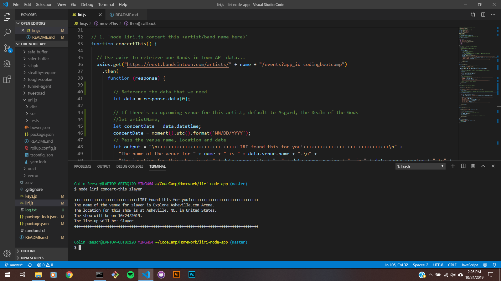

# liri-node-app
Language interpretation and recognition interface that uses "bands in town", "Spotify", and "OMDB" APIs.

LIRI is SIRI's hot step-sister, and she's a genius! LIRI solves the problem of figuring out who the artist is behind a certain song that you can't get out of your head, finding relative information pertaining to a movie title search, digging up information about any upcoming shows that an artist may have scheduled, and just in case you have a short memory, she'll log all of your search history in a text file. She's great, right?!

The LIRI app is organized through several node packages, modules and APIs - all manipulated through a couple of JavaScript files. The main flow of functionality passes through a switch statement that passes query commands and keywords on to local functions that will perform a search and return the results on-screen and in a text file.

1. Type "node liri", followed by a space and one of the following:
    1) "concert-this" - finds the next live performance for an artist.
    2) "spotify-this-song" - returns information pertaining to a song title.
    3) "movie-this" - returns information about a movie.
    4) "do-what-it-says" - returns hard-coded results.
2. Next, enter the artist name (if "concert-this"), or the song title (if "spotify-this-song"), or movie title (if "movie-this").
3. If you need to recall your previous search results, you can reference log.txt.

Concert search

****
Spotify search

****
Movie search

****
"do-what-it-says" hard-coded search demo

****
Example of the log file

5. Contain a link to a deployed version of the app

6. Clearly list the technologies used in the app

For this assignment, LIRI required GitHub as our repository, Axios for our requests to the API's

7. State your role in the app development

Screenshots!

Video!