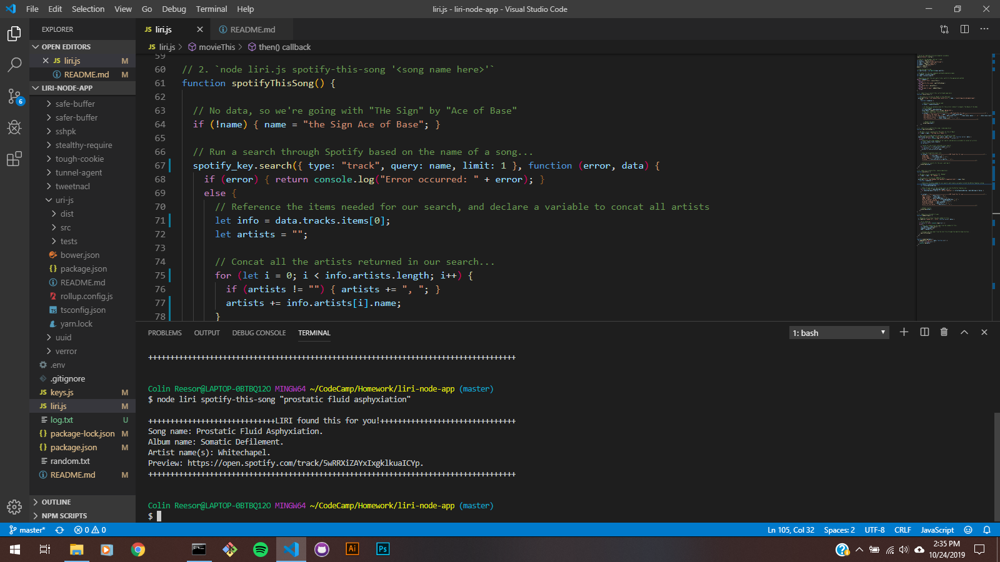
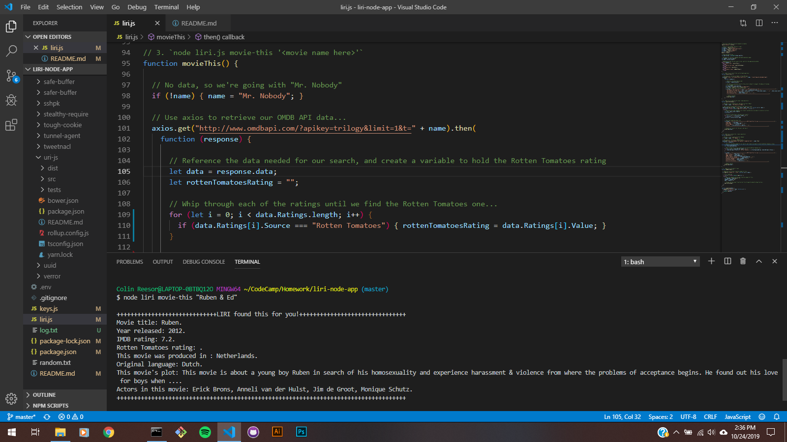
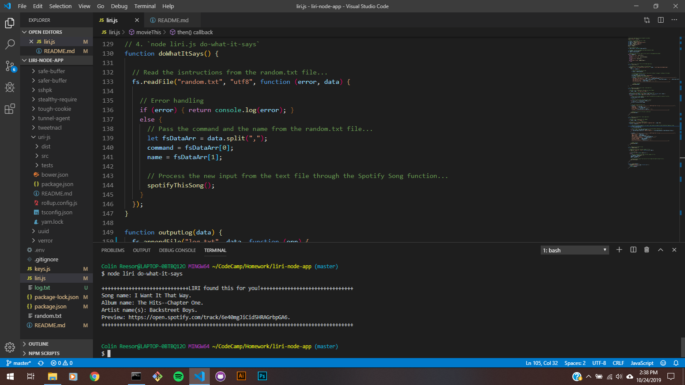
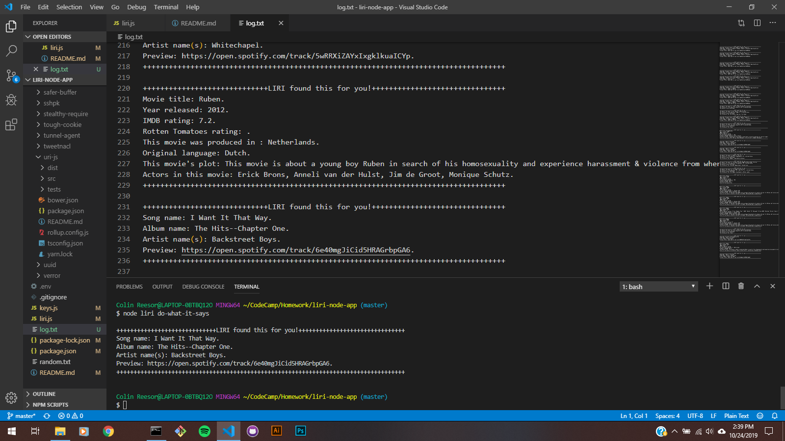

# liri-node-app
Language interpretation and recognition interface that uses "bands in town", "Spotify", and "OMDB" APIs.
****
## LIRI - The What and Why
LIRI is SIRI's hot step-sister, and she's a genius! LIRI solves the problem of figuring out who the artist is behind a certain song that you can't get out of your head, finding relative information pertaining to a movie title search, digging up information about any upcoming shows that an artist may have scheduled, and just in case you have a short memory, she'll log all of your search history in a text file. She's great, right?!
****
## Overview
The LIRI app is organized through several node packages, modules and APIs - all manipulated through a couple of JavaScript files. The main flow of functionality passes through a switch statement that passes query commands and keywords on to local functions that will perform a search and return the results on-screen and in a text file.
****
## LIRI Commands
1. Type "node liri", followed by a space and one of the following:
    1) **concert-this** - finds the next live performance for an artist.
    2) **spotify-this-song** - returns information pertaining to a song title.
    3) **movie-this** - returns information about a movie.
    4) **do-what-it-says** - returns hard-coded results.
2. Next, enter the artist name (if "concert-this"), or the song title (if "spotify-this-song"), or movie title (if "movie-this").
3. If you need to recall your previous search results, you can reference log.txt.
****
## Screenshots

### Concert search


****

### Spotify search


****

### Movie search


****

### "do-what-it-says" hard-coded search demo


****

### Example of the log file


5. Contain a link to a deployed version of the app

## Setting up LIRI...
1. First, we need to obtain a **CLIENT ID** and a **CLIENT SECRET** from [Spotify](https://developer.spotify.com/my-applications/#!/).
    1) Login with an existing account or create a new FREE one.
    2) Once you're logged in, register a new app to use Spotify's API and it's NPM.
    3) You'll be given your **CLIENT ID** and **CLIENT SECRET** on the next screen. You'll have to copy them somewhere so you don't lose them.
    4) Next, you'll create an '.env' file in your project root folder.
        1.  You'll copy this code into it: 
        ```js
        SPOTIFY_ID=your-spotify-id
        SPOTIFY_SECRET=your-spotify-secret
        ```
    5) ...And add your **CLIENT ID** and **CLIENT SECRET** to it.

2. Lastly, you'll need to install all node packages while in your root project folder. Enter these commands in the CLI one at a time:

`npm init -y`

`npm install`


****
## Tech used by LIRI

### **Spotify-API**
Music searches
### **Node**
File writing and CLI
### **Node Package Manager**
API requests and CLI
### **Axios**
API requests
### **Moment**
Date formatting
### **Dotenv**
Set environmental variables

****
## Development

Colin Reesor created this version of the LIRI bot!

****
## Demo Video

Check out the [live demo](video/LIRI_homework_demo.webm)